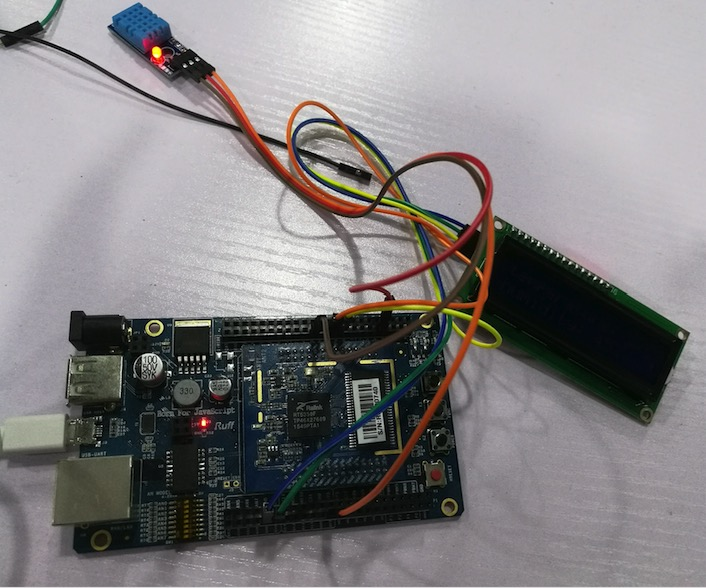
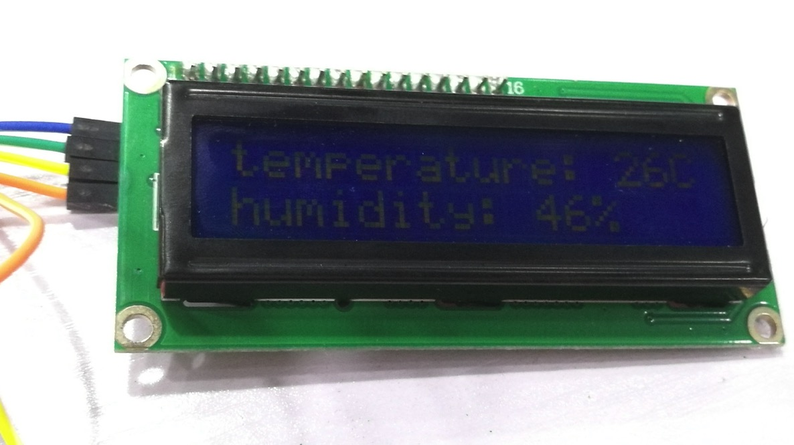

# Ruff Application
a ruff project，displaying temperature and humidity with LCD

ruff项目： 温湿度显示器

## 模块
+ ruff-mbd-v1: ruff kit 
+ DHT11: 温湿度传感器
+ LCD1602-02: 16*2液晶显示器

## 功能
读取温度和湿度，在液晶显示器上显示出来

## 效果

